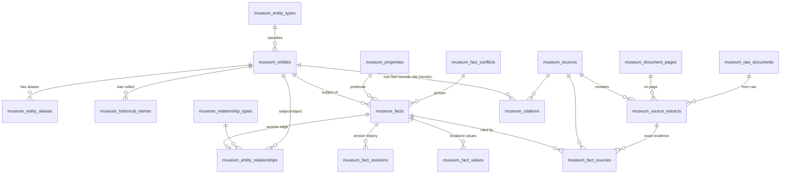

# معماری «موزه دیجیتال هرمزگان‌شناسی»

> سه اصل غیرقابل مذاکره: **Accuracy · Traceability · Preservation**
>
> این سند پیش از نوشتن Migrationها تهیه شده و مبنای پیاده‌سازی است. هر تصمیم طراحی همراه با دلیل آن آمده است.

---

## STEP 1 — تحلیل پروژه موجود

| مورد | وضعیت |
|---|---|
| Repository | در زمان شروع کاملاً خالی بود (بدون commit، بدون فایل). |
| نتیجه | یک اپلیکیشن Laravel 11 (PHP 8.3) ساخته شد و موزه به‌عنوان یک **Module ایزوله** درون آن پیاده شد. |
| ایزوله‌سازی | همه جدول‌ها با پیشوند `museum_`، همه کلاس‌ها در فضای‌نام `…\Museum\…`، همه مسیرها زیر `/museum` و `/api/museum` و `/museum/admin`. اگر سایت اصلی بعداً اضافه یا ادغام شود، هیچ تداخلی در نام جدول/مسیر/کلاس رخ نمی‌دهد. |
| ابزار موجود در محیط | PHP 8.3 (pdo_mysql, pdo_sqlite, redis, intl, gd)، Redis، FFmpeg، `pdftotext`. MySQL server در محیط توسعه نیست؛ تست‌ها روی SQLite اجرا می‌شوند و Schema طوری نوشته شده که روی MySQL 8 (هدف Production) هم اجرا شود (FULLTEXT فقط روی MySQL ساخته می‌شود). |

---

## نمای کلی سیستم

```
                    ┌──────────────────────────── Public ────────────────────────────┐
                    │  Museum UI (Blade, RTL, mobile-first)   REST API /api/museum/*  │
                    └───────────────┬───────────────────────────────┬────────────────┘
                                    │ read (cached, published only) │
┌───────────────────────────────────▼───────────────────────────────▼──────────────────┐
│                               Knowledge Base (MySQL)                                   │
│  entities ─ aliases ─ historical_names ─ facts ─ fact_sources ─ source_extracts ─ sources│
│  entity_relationships (graph edges, each backed by a fact)                              │
│  domain extensions: places, words, dialects, foods, plants, people, documents, ...      │
└───────▲──────────────────────▲────────────────────────▲─────────────────▲──────────────┘
        │ human review          │ accepted candidates     │ index            │ embeddings
┌───────┴────────┐   ┌──────────┴─────────────┐   ┌───────┴───────┐  ┌───────┴────────┐
│ Admin / Expert │   │ Data Pipeline (queues) │   │ Search Index  │  │ Vector Store   │
│ Verification   │   │ crawl→raw→text→OCR→AI  │   │ MySQL FT /    │  │ DB / Qdrant    │
│ Conflicts, Dups│   │ extract→resolve→dedup  │   │ OpenSearch    │  │                │
└────────────────┘   └──────────▲─────────────┘   └───────────────┘  └────────────────┘
                                │
              Source Registry + Crawler Sources (robots.txt / ToS / license gated)
```

همه کارهای سنگین (Crawl، OCR، استخراج AI، Embedding، Reindex، پردازش رسانه) در **Laravel Queue (Redis)** و Jobهای جدا اجرا می‌شوند؛ هیچ Request وب منتظر آنها نمی‌ماند.

---

## STEP 2 — معماری Database و Knowledge

### ۲.۱ الگوی اصلی: Entity Core + Domain Extensions + Sourced Facts

سه انتخاب ممکن بود:

1. **جدول جدا برای هر حوزه، بدون هسته مشترک** — جستجو، Alias، Provenance، Graph و Verification باید ۲۵ بار تکرار شود. رد شد.
2. **EAV کامل** — انعطاف زیاد ولی Query و Validation ضعیف. رد شد.
3. **Class-Table Inheritance + Facts (انتخاب‌شده)**:
   - هر چیز «قابل‌نام‌بردن» (مکان، واژه، غذا، گیاه، شخص، سند، مصاحبه، رویداد، ساز، لباس، جزء لنج، …) یک ردیف در `museum_entities` دارد.
   - ویژگی‌های **ساختاری/هویتی** و قابل‌فیلتر هر نوع در جدول Extension یک‌به‌یک (`museum_places.entity_id`, `museum_words.entity_id`, …) نگه داشته می‌شوند: سلسله‌مراتب، مختصات، نام علمی، گویش، بازه تاریخ و …
   - هر **ادعای توصیفی** (جمعیت سال ۱۳۹۵، وجه تسمیه، فصل کاشت، طعم رقم خرما، مواد غذا، تاریخ تأسیس، …) یک **Fact** است با نوع داده، اطمینان، وضعیت تأیید و منبع. این کلید Source-First است: هیچ متن توصیفی بی‌منبع در ستون‌های جدول‌های دامنه نوشته نمی‌شود.
   - Property Registry (`museum_properties`) تعیین می‌کند هر نوع Entity چه Propertyهایی دارد، نوع داده‌شان چیست و برچسب فارسی/انگلیسی‌شان چیست. افزودن ویژگی جدید = یک ردیف، نه Migration.

### ۲.۲ ERD هسته (Knowledge + Provenance)



**Provenance chain (در سطح Database):**

```
Fact ──► FactSource ──► Source            (کتاب/مقاله/سند/مصاحبه/دیتاست)
             │
             └────────► SourceExtract     (page_number, locator, original_text, normalized_text)
                             │
                             ├──► DocumentPage (OCR خام + متن اصلاح‌شده)
                             └──► RawDocument  (فایل خام دریافتی، هرگز حذف نمی‌شود، sha256)
```

نتیجه: دکمه «مشاهده منبع» در UI همیشه به `/museum/facts/{uuid}` می‌رود که دقیقاً منبع، صفحه، متن اصلی و Extract را نشان می‌دهد.

### ۲.۳ ERD دامنه‌ها

```mermaid
erDiagram
    museum_entities ||--o| museum_places : extends
    museum_places }o--o| museum_places : "parent (admin hierarchy)"
    museum_entities ||--o| museum_dialects : extends
    museum_dialects ||--o{ museum_dialect_areas : "spoken in place"
    museum_entities ||--o| museum_words : extends
    museum_words ||--o{ museum_word_meanings : senses
    museum_words ||--o{ museum_word_pronunciations : "native recordings"
    museum_words ||--o{ museum_word_examples : examples
    museum_words ||--o{ museum_word_relations : related
    museum_concepts ||--o{ museum_words : "expresses (dialect comparison)"
    museum_sentences ||--o{ museum_word_examples : ""
    museum_speakers ||--o{ museum_audio_recordings : "recorded by"
    museum_media ||--o| museum_audio_recordings : extends
    museum_media ||--o| museum_photos : extends
    museum_media ||--o| museum_videos : extends
    museum_entities ||--o| museum_interviews : extends
    museum_interviews ||--o{ museum_interview_segments : "timestamped"
    museum_interview_segments ||--o{ museum_mentions : "mentions entity"
    museum_entities ||--o| museum_documents : extends
    museum_documents ||--o{ museum_document_pages : pages
    museum_entities ||--o| museum_foods : extends
    museum_foods ||--o{ museum_food_ingredients : ""
    museum_foods ||--o{ museum_recipes : ""
    museum_entities ||--o| museum_plants : extends
    museum_plants ||--o{ museum_plant_varieties : "cultivars (e.g. date palm)"
    museum_entities ||--o| museum_clothing_items : "extends (component tree)"
    museum_entities ||--o| museum_people : extends
    museum_entities ||--o| museum_historical_events : extends
    museum_diagrams ||--o{ museum_diagram_hotspots : "interactive lenj/clothing"
```



### ۲.۴ فهرست جدول‌ها و نقش‌ها

| گروه | جدول‌ها |
|---|---|
| Taxonomy | `entity_types`, `relationship_types`, `properties`, `categories`, `tags`, `taggables` |
| Knowledge Graph | `entities`, `entity_aliases`, `historical_names`, `entity_relationships`, `facts`, `fact_values`, `fact_revisions`, `fact_conflicts`, `translations`, `mentions`, `entity_merges` |
| Provenance | `sources`, `source_extracts`, `fact_sources`, `citations` |
| Geography | `places`, `locations` (هندسه زمان‌دار برای «هرمزگان در گذر زمان»), `maps` |
| Language | `dialects`, `dialect_areas`, `concepts`, `words`, `word_meanings`, `word_pronunciations`, `word_examples`, `word_relations`, `sentences`, `grammar_rules`, `grammar_examples`, `proverbs`, `speakers` |
| Culture/Nature/Sea | `foods`, `food_ingredients`, `recipes`, `plants`, `plant_varieties`, `traditions`, `clothing_items`, `crafts`, `games`, `music_items`, `people`, `historical_events`, `diagrams`, `diagram_hotspots` |
| Media/Archive | `media`, `mediables`, `audio_recordings`, `photos`, `photo_pairs` (Then/Now), `videos`, `documents`, `document_pages`, `interviews`, `interview_segments` |
| Pipeline | `crawler_sources`, `crawler_jobs`, `raw_documents`, `import_batches`, `extraction_jobs`, `extraction_candidates`, `ai_jobs`, `duplicate_candidates`, `research_tasks` |
| Search/RAG | `search_documents`, `text_chunks`, `embeddings`, `rag_queries` |
| Governance | `community_submissions`, `verification_logs`, `roles`, `permissions`, `role_user`, `permission_role`, `quality_snapshots` |

همه با پیشوند `museum_`.

### ۲.۵ تصمیم‌های Normalization

- **مکان یک Entity است**، نه رشته. هر جا «منطقه/محل» لازم است (`place_entity_id`) به Entity مکان ارجاع می‌شود؛ بنابراین گویش‌ها/واژه‌ها/غذاها در سطح Province → County → District → City → Rural District → Village → Neighborhood قابل تعیین‌اند.
- **سلسله‌مراتب مکانی** با `parent_entity_id` + `path` (Materialized Path مانند `/12/40/311/`) و `depth` نگه داشته می‌شود تا Query «همه روستاهای شهرستان میناب» با یک `LIKE '/12/40/%'` روی ایندکس انجام شود.
- **تفاوت منطقه‌ای** (آداب، دستور غذا، تلفظ) با ستون `scope_place_entity_id` روی Fact مدل می‌شود؛ یعنی «این ادعا درباره این Entity در این مکان» — بدون جدول جداگانه برای هر حوزه.
- **یال‌های Graph** (`entity_relationships`) همیشه یک `fact_id` دارند: یال بی‌منبع وجود ندارد. Relationship درواقع Materialized View برای پیمایش سریع Graph است.
- **جمله‌ها** (۱۰۰هزار+) Entity نیستند چون به Graph نیاز ندارند؛ جدول مستقل با `citations` و وضعیت تأیید دارند.
- **Speaker** جدول جدا با داده‌های رضایت (Consent) است و اطلاعات تماس هرگز در API عمومی نمایش داده نمی‌شود.
- **Merge** هیچ‌وقت حذف فیزیکی نیست: Entity ادغام‌شده `merged_into_id` می‌گیرد و Snapshot آن در `entity_merges` ذخیره می‌شود.
- Soft delete برای Entity/Fact/Source/Media؛ Raw Data اصلاً متد حذف ندارد (Model Guard).

### ۲.۶ ظرفیت (Design Capacity)

| شیء | هدف | راهبرد |
|---|---|---|
| Facts | 1,000,000+ | ایندکس مرکب `(entity_id, property_id, verification_status)`، `value_hash` برای تشخیص تکرار/تعارض در O(log n)، Partition-ready (کلید `id` BIGINT). |
| Words/Sentences | 100,000+ | `normalized_*` ایندکس‌دار + FULLTEXT ngram در MySQL + Search Index خارجی. |
| Places | 10,000+ | Materialized path + ایندکس lat/lng. |
| Media/Documents | 100,000+ | فایل‌ها در S3-compatible Object Storage، فقط Metadata در DB، Variants (thumbnail/webp) در Queue. |
| Search | میلیون‌ها سند | `museum_search_documents` جدول Denormalized؛ Driverهای `database` / `mysql_fulltext` / `opensearch` قابل سوئیچ با Config. |

این اعداد **ظرفیت طراحی** هستند؛ با داده ساختگی پر نمی‌شوند.

---

## STEP 3 — مدل Source / Provenance

### Source
`source_type` ∈ `book, article, thesis, encyclopedia, gazetteer, government_dataset, census, open_dataset, archive_document, map, newspaper, photo_archive, website, interview, field_recording, community_submission`

فیلدها (مطابق بند ۳ صورت مسئله): `uuid, source_type, title, title_original, author, publisher, publication_date (+precision), url, container_title (book_name), volume, edition, isbn, doi, archive_reference, language, retrieved_at, license, copyright_status, reliability_tier, crawl_policy, verification_status, reviewed_by, reviewed_at, metadata(json)`.

- `reliability_tier` (۱ تا ۵) = اعتماد به **منبع**؛ `verification_status` روی Fact = آیا **ادعا** در منبع تأیید شده است. این دو مفهوم جدا نگه داشته می‌شوند.
- `original_text` و `normalized_text` و `page_number` و `confidence_score` در سطح **SourceExtract** و **FactSource** ذخیره می‌شوند (چون یک منبع صدها Extract دارد).

### وضعیت تأیید (Verification Status) — ترتیب‌دار

| مقدار | معنا |
|---|---|
| `unverified` | ثبت شده، هنوز بررسی نشده (مثلاً ورود دستی بی‌مدرک، ارسال مردمی). |
| `ai_extracted` | توسط AI از یک Extract مشخص استخراج شده؛ انسان تطبیق نداده. |
| `source_verified` | وجود ادعا در منبع ذکرشده تأیید شده (توسط بازبین، یا Import ساختاریافته که مقدار را مستقیماً از رکورد منبع خوانده). |
| `community_verified` | تأیید چند مشارکت‌کننده/بومی مستقل. |
| `expert_verified` | تأیید کارشناس حوزه. |

علاوه بر این: `disputed` (عضو Conflict باز) و `rejected` (رد شده ولی **حذف نشده**).

### قوانین Hallucination (بند ۵۴)
- مقدار ناموجود → `is_unknown = true` و `value_type = unknown` (نمایش «UNKNOWN / نامعلوم»)؛ هیچ مقدار احتمالی ساخته نمی‌شود.
- AI Extractor فقط مقادیری را می‌پذیرد که **Quote آن‌ها عیناً در متن منبع** پیدا شود (Evidence Span Check). در غیر این صورت Candidate رد می‌شود.
- هر Extraction دارای `confidence_score` است. زیر آستانه → صف «Low Confidence».
- RAG: اگر Context کافی نباشد پاسخ «در پایگاه دانش اطلاعات کافی وجود ندارد» است و هر جمله پاسخ باید `[n]` Citation معتبر داشته باشد؛ پاسخ بدون Citation معتبر رد می‌شود.

### Contradiction Engine (بند ۵۵)
هنگام ثبت Fact جدید برای `(entity, property, scope_place, qualifiers-key)` اگر Fact فعالی با `value_hash` متفاوت وجود داشته باشد (و Property تک‌مقداری باشد)، یک `fact_conflict` ساخته/به‌روز می‌شود و همه Factهای رقیب به آن متصل می‌شوند (`conflict_id`). سطح تأیید هیچ Factی پایین آورده نمی‌شود و هیچ‌کدام حذف نمی‌شود؛ UI کنار آنها نشان «اختلاف منابع» نمایش می‌دهد. Fact با مقدار UNKNOWN با مقدار معلوم تعارض محسوب نمی‌شود. کارشناس یکی را `preferred` می‌کند یا هر دو را «اختلاف منابع» نگه می‌دارد. اگر مقدار یکسان باشد، فقط منبع جدید به Fact موجود اضافه می‌شود (Corroboration).

### Version History (بند ۵۲)
هر تغییر مقدار/وضعیت Fact یک `fact_revision` می‌سازد: `previous_value, new_value, editor, reason, source, created_at`. Update مستقیم روی ستون‌های مقدار فقط از طریق `FactService` مجاز است.

---

## STEP 5/6 — Data Acquisition & Extraction Architecture

```
SourceRegistry ─► CrawlerSource (robots.txt + ToS + license gate, crawl_delay)
      │
      ▼
FetchJob ─► RawDocument (storage: museum_raw disk, sha256, never deleted, dedup by hash)
      ▼
ExtractTextJob ─► pdftotext / HTML→text / OCR (Tesseract driver, raw OCR preserved)
      ▼
ChunkJob ─► text_chunks (page-aware) ─► EmbedJob
      ▼
AiExtractionJob (Claude, JSON tool schema; evidence-quote required)
      ▼
extraction_candidates (entity/alias/fact/relationship)
      ▼
EntityResolver (normalize → alias index → fuzzy → type/place constraints)
      ▼
DuplicateDetector ─► duplicate_candidates
      ▼
Candidate Review (auto-accept only for structured imports from tier≥4 sources)
      ▼
FactService (provenance, conflict engine, revisions) ─► Knowledge Base ─► Reindex
```

- **Importerها** (ساختاریافته): Wikidata SPARQL (CC0) برای Phase A، CSV/JSON عمومی (Source Registry، واژه‌ها، جمله‌ها، فرهنگ آبادی‌ها پس از OCR)، فایل‌های محلی.
- **Discovery Engine**: هر Candidate Entity که به هیچ Entity موجود Resolve نشود، `discovery` ثبت می‌شود؛ هر بار در منبع دیگری دیده شود `evidence_count` بالا می‌رود؛ با رسیدن به آستانه (پیش‌فرض ۲ منبع مستقل) وارد Verification Queue می‌شود.
- **Research Agent**: `research_tasks` → جستجوی Source Registry و Search Index → صف Fetch برای منابع مجاز → Extraction → مقایسه → Candidate + Citation → Verification Queue. هرگز Publish مستقیم ندارد.
- **Import Report** (بند ۶۱): هر `import_batch` شمارنده‌های `sources_found, sources_accepted, sources_rejected, documents_processed, facts_extracted, entities_created, entities_matched, duplicates, conflicts, low_confidence, errors` را دارد.

---

## STEP 9 — Search & RAG Architecture

- **Normalization فارسی/عربی/لاتین** یکسان برای ایندکس و Query: `ي→ی`، `ك→ک`، `ة→ه`، حذف اعراب و تطویل، یکسان‌سازی نیم‌فاصله/فاصله/خط تیره، ارقام فارسی/عربی→لاتین، حذف `-e`/`-ye` اضافه در لاتین («Bandar-e Abbas» = «Bandar Abbas»)، و یک **کلید فشرده بدون فاصله** («بندر عباس» = «بندرعباس»).
- **Search Documents**: هر Entity/Sentence/Document Page/Interview Segment/Media یک ردیف denormalized با `title, aliases (همه Alias و نام تاریخی), body, type, place, years`. جستجوی «سورو» به Alias و نام تاریخی و واژه و جمله و صفحه سند و قطعه مصاحبه برخورد می‌کند.
- **Engines**: `database` (LIKE روی ستون‌های نرمال‌شده؛ برای SQLite/تست)، `mysql_fulltext` (FULLTEXT با ngram parser برای فارسی)، `opensearch` (HTTP).
- **Semantic**: `text_chunks` → `embeddings` (float32 packed). VectorStore: `database` (cosine brute-force دسته‌ای، تا ~۲۰۰هزار chunk) یا `qdrant` (HTTP) برای حجم بالا. Embedding Provider قابل تعویض (`voyage`/OpenAI-compatible؛ و `hashing` محلی برای حالت آفلاین).
- **RAG**: Query Analysis (نرمال‌سازی + تشخیص مکان/نوع) → Hybrid (Keyword + Vector) → Reciprocal Rank Fusion → Reranking → Claude با Prompt «فقط از Context، با [n]» → اعتبارسنجی Citationها → پاسخ + فهرست منابع. همه پرسش‌ها در `rag_queries` لاگ می‌شوند.

---

## STEP 8/10 — Verification & Admin Workflow

```
Community Submission:  submitted → ai_checked → moderator_checked → expert_verified → published
                                           ↘ rejected (preserved)
Fact:  unverified / ai_extracted → source_verified → community_verified → expert_verified
                       ↘ disputed (conflict) ↘ rejected
```

نقش‌ها: `admin`, `editor`, `moderator`, `expert`, `researcher`, `contributor`. Permissionها در Seeder تعریف می‌شوند (`facts.verify`, `facts.expert_verify`, `conflicts.resolve`, `submissions.moderate`, `media.publish_restricted`, `pipeline.run`, …). هر تغییر وضعیت در `verification_logs` ثبت می‌شود.

پنل مدیریت (`/museum/admin`): Dashboard کیفیت داده، Dashboard Big Data، صف تأیید، Conflictها، Duplicateها، Candidateها (Discovery)، Sources، Crawler، Imports، AI Jobs، Submissions، و Editor عمومی Entity برای همه انواع (Places, Words, Foods, …) با Facts و Citationها.

---

## STEP 11 — Public UI Structure

| مسیر | محتوا |
|---|---|
| `/museum` | Hero «موزه دیجیتال هرمزگان»، جستجوی بزرگ، نقشه تعاملی، درهای ورود: Language, History, Sea, Food, People, Nature, Culture, Archive |
| `/museum/explore` | «کشف هرمزگان» — هر بار یک واژه، غذا، مکان، عکس تاریخی، ضرب‌المثل، شخصیت، گیاه، موسیقی (فقط منتشرشده‌ها) |
| `/museum/search`, `/museum/ask` | جستجوی Hybrid و پرسش RAG با Citation |
| `/museum/e/{slug}` | صفحه Entity: Facts گروه‌بندی‌شده با نشان وضعیت و «مشاهده منبع»، نام‌های تاریخی، Aliasها، روابط Graph، رسانه، مصاحبه‌های مرتبط |
| `/museum/facts/{uuid}` | Provenance کامل یک Fact |
| `/museum/places`, `/museum/language/*`, `/museum/history/*`, `/museum/sea`, `/museum/sea/lenj`, `/museum/food`, `/museum/nature`, `/museum/culture/*`, `/museum/people`, `/museum/archive`, `/museum/interviews` | بخش‌های موضوعی |
| `/museum/language/compare` | مقایسه گویش‌ها: جدول + نقشه + صدا، فقط داده مستند |
| `/museum/history/timeline`, `/museum/history/map` | Timeline با فیلتر و نقشه با اسلایدر زمان |
| `/museum/contribute` | «شما هم به موزه کمک کنید» |
| `/museum/kids` | «هرمزگان برای کودکان» |

هویت بصری: پالت شن (`#E9DCC3`)، دریای خلیج فارس (`#0E5E6F`)، فیروزه‌ای، سبز نخل، قرمز گلابتون؛ نوار الگوی پارچه هرمزگانی (CSS، بدون تصویر)، تایپوگرافی Vazirmatn، چیدمان موزه‌ای با فضای سفید زیاد. بدون Framework سنگین؛ Leaflet + OSM برای نقشه.

---

## Performance, Backup, Copyright

- **Performance**: ایندکس‌های مرکب، Cache نسخه‌دار (`museum:cache-version` که با هر انتشار bump می‌شود)، Redis Queue با صف‌های جدا (`museum-crawl`, `museum-extract`, `museum-ai`, `museum-index`, `museum-media`)، Pagination اجباری در API (حداکثر ۱۰۰)، Lazy loading تصاویر، CDN با `MUSEUM_CDN_URL`.
- **Backup** (`museum:backup`): Dump پایگاه داده + Manifest با sha256 تمام فایل‌های Raw/Media/Audio + Metadata؛ آپلود به دیسک Backup (S3-compatible) با نام نسخه‌دار؛ Retention قابل تنظیم؛ زمان‌بندی روزانه در Scheduler.
- **Copyright**: `license` ∈ `public_domain, cc0, cc_by, cc_by_sa, cc_by_nc, cc_by_nc_sa, cc_by_nd, cc_by_nc_nd, permission_granted, restricted, unknown`. `MediaPolicy::isPubliclyServable()` فایل `restricted` و `unknown` را منتشر نمی‌کند (Metadata قابل نمایش، فایل نه). صدای مصاحبه بدون Consent معتبر منتشر نمی‌شود.
- **تلفظ**: `audio_recordings.is_synthetic` — ضبط TTS هرگز به‌عنوان مدرک تلفظ (`word_pronunciations`) پذیرفته نمی‌شود (Validation در Service و API).
